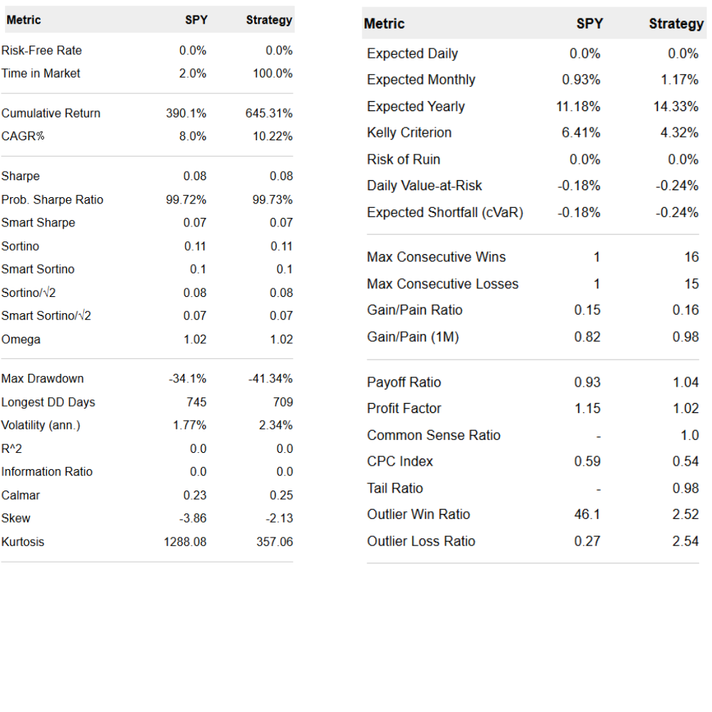

# Simplified Investment & Trading Toolkit


[](https://bbstrader.readthedocs.io/en/latest/?badge=latest)

[Dcoumentation](https://bbstrader.readthedocs.io/en/latest/index.html)
## Overview

BBSTrader is a trading system suite developed for MetaTrader 5 (MT5) and IBKR platforms (comming soon), designed to offer a comprehensive set of tools for developping, backtesting, executing, and managing a wide array of trading strategies. With an emphasis on algorithmic and quantitative trading to provide traders with a robust platform for exploring and deploying sophisticated trading strategies.

`bbstrader` is comprised of several key modules, each focus on specific aspects of trading strategy development and execution:

- **Backtesting Module (btengine)** : Enables traders to rigorously test their trading strategies using historical data to evaluate performance before live deployment.
- **Trading Strategies Module**: A collection of predefined trading strategies, including ARIMA+GARCH models, Kalman Filters, and Simple Moving Averages, equipped with risk management through Hidden Markov Models.
- **MetaTrader5 Module (metatrader)**: Facilitates the direct execution of trading strategies on the MetaTrader 5 platform, supporting real-time trading across multiple financial instruments.
- **Modles Module**: Serves as a framework for implementing various types of financial models (risk managment models, Machine learing models etc).
- **Time serie Module (tseries)** designed for conducting advanced time series analysis in financial markets. 
It leverages statistical models and algorithms to perform tasks such as cointegration testing, volatility modeling, and filter-based estimation to assist in trading strategy development, market analysis, and financial data exploration.

## Features

- **Comprehensive Backtesting**: Assess the performance of trading strategies with historical market data to optimize parameters and strategies for live trading environments.
- **Integrated Risk Management**: Leverage advanced risk management techniques to adapt to changing market conditions and maintain control over risk exposure.
- **Automated Trading**: Execute trades automatically on the MT5 platform, with support for managing orders, positions, and risk in real-time.
- **Flexible Framework**: Customize existing strategies or develop new ones with the flexible, modular architecture designed to accommodate traders' evolving needs.
- **Advanced Time Series Analysis**: Conduct in-depth analysis of financial time series data to identify patterns, trends, and relationships that can inform trading strategies.
You can read the full documentation [here](https://bbstrader.readthedocs.io/en/latest/index.html)

## Getting Started

Before you can use the bbstrader and the metratrader, you need to have MetaTrader 5 (MT5) installed on your computer and an active MT5 trading account. 
This Module currenlty support three brokers, [Admirals Group AS](https://cabinet.a-partnership.com/visit/?bta=35537&brand=admiralmarkets), [Just Global Markets Ltd.](https://one.justmarkets.link/a/tufvj0xugm/registration/trader), and [FTMO](https://trader.ftmo.com/?affiliates=JGmeuQqepAZLMcdOEQRp), so you need to create a demo or live account with one of them.
* If you want to trade `Stocks`, `ETFs`, `Indices`, `Commodities`, `Futures`, and `Forex`, [click here](https://cabinet.a-partnership.com/visit/?bta=35537&brand=admiralmarkets)
* If you want to trade `Stocks`, `Crypto`, `indices`, `Commodities`, and `Forex`, [click here](https://one.justmarkets.link/a/tufvj0xugm/registration/trader)
* If you are looking for a prop firm, [click here](https://trader.ftmo.com/?affiliates=JGmeuQqepAZLMcdOEQRp)

Then, you can install `bbstrader` using pip:
```bash
pip install bbstrader
```

## Examples
### Backtesting Module
```python
from bbstrader.trading.strategies import test_strategy

if __name__ == '__main__':
    # Run backtesting for Stock Index Short Term Buy Only Strategy
    test_strategy(strategy='sistbo')
    
```
### Backtesting Results




## Customization and Contribution

`bbstrader`'s modular design allows for easy customization and extension. Traders and developers are encouraged to modify existing strategies, add new ones, or enhance the system's capabilities. Contributions to the `bbstrader` project are welcome.

## Contributing to BBSTrader

We warmly welcome contributions from the trading and development community! Whether you're interested in fixing bugs, adding new features, or improving documentation, your help is invaluable to making `bbstrader` more robust and versatile. Here's how you can contribute:

### Ways to Contribute

- **Develop New Strategies**: Implement and share your unique trading strategies or models.
- **Enhance Existing Modules**: Optimize the performance, extend the functionality, or improve the usability of existing modules.
- **Report Bugs**: Identify and report bugs to help us improve the system's stability and performance.
- **Improve Documentation**: Contribute to the project's documentation for clearer guidance and better usability.
- **Share Insights and Best Practices**: Provide examples, tutorials, or best practices on utilizing `bbstrader` effectively.

### How to Get Started

1. **Fork the Repository**: Start by forking the `bbstrader` repository to your GitHub account.
2. **Clone Your Fork**: Clone your forked repository to your local machine to start making changes.
3. **Set Up Your Development Environment**: Ensure you have the necessary development environment set up, including Python, MetaTrader 5, and any dependencies.
4. **Create a New Branch**: Make your changes in a new git branch, branching off from the main branch.
5. **Implement Your Changes**: Work on bug fixes, features, or documentation improvements.
6. **Test Your Changes**: Ensure your changes do not introduce new issues and that they work as intended.
7. **Submit a Pull Request**: Once you're ready, submit a pull request (PR) against the main `bbstrader` repository. Include a clear description of the changes and any other relevant information.

### Contribution Guidelines

Please adhere to the following guidelines to ensure a smooth contribution process:

- **Follow the Coding Standards**: Write clean, readable code and follow the coding conventions used throughout the project.
- **Document Your Changes**: Add comments and update the README.md files as necessary to explain your changes or additions.
- **Respect the License**: All contributions are subject to the MIT License under which `bbstrader` is distributed.

We're excited to see your contributions and to welcome you to the `bbstrader` community. Together, we can build a powerful tool that serves the needs of traders around the world.


## Disclaimer

Trading financial instruments involves a high level of risk and may not be suitable for all investors. The developers of `bbstrader` are not responsible for any financial losses incurred from the use of this software. Trade responsibly and at your own risk.

## License
`bbstrader` is open source and available under the MIT License.
